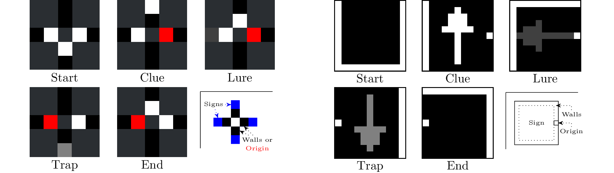

# Summary

The need to provide fair comparisons between agents, especially in the field of Reinforcement Learning, has led to a plethora of benchmarks.
While these are devoted to tailor-made problems, they offer with very little degrees of freedom for the experimenter.
AMaze is instead a benchmark *generator* capable of producing human-intelligible environments of arbitrarily high complexity.
By using visual cues in a maze-navigation task, the library empowers researchers across a large range of fields.

# Statement of need

AMaze is a pure-Python package with an emphasis on the easy and intuitive generation, evaluation and analysis of mazes.
Its primary goal is to provide a way to quickly generate mazes of targeted difficulty, e.g., to test a Reinforcement Learning algorithm.
Users of AMaze have two main components to take into consideration: mazes and agents.
These are introduced below with more details available in the documentation[^1].

## Mazes

Every maze can be described by human-readable string as illustrated in \autoref{fig:maze}, where every component is optional with sensible default values.
The *seed* is used in the random number generator responsible for: a) the depth-first search that creates the paths and b) the stochastic placement of the *lures* and *traps*.
As will be detailed below, agents only see a single cell at a time making intersections impossible to handle without additional information.
*Clues* provide such an information by helpfully pointing towards the correct direction.
However, users may additionally specify the presence of *traps*, at a given frequency, to replace a clue at an intersection.
Traps always point towards the wrong direction thereby forcing agents to discriminate between the two.
Furthermore, there is a lighter class of negative sign, namely *lures*, which occur outside of intersection and unhelpfully point towards an obviously bad direction (e.g. a wall).

Mazes can broadly be grouped into classes according to the features they exhibit.
The most *trivial* cases correspond to mazes with a single path (enforced by removing intersections).
When intersections are labeled with appropriate clues, mazes are considered as *simple*.
Additionally, exhibiting either lures or traps form the corresponding classes while the more general case with all types of signs is labeled as *complex*.
To accurately compare between different types of mazes across multiple categories, the library provides, for any given maze $M$, two dedicated metrics, the surprisingness $S_M$ and deceptiveness $D_M$ defined as follows:

$$S_M = - \sum\limits_{i \in I_M} p(i) * log_2(p(i))$$
$$D_M = \sum\limits_{c \in \text{cells}(M)}
           \sum\limits_{\substack{s \in \text{traps}(M)\\s[0:3] = c}}
            - p(s|c) log_2(p(s|c))$$

which, informally, account for the likelihood of encountering different states (walls, signs) and different *variations* of a given cell (same walls, different signs).
Through these metrics, experimenters can make an informed decision about the level of complexity of the mazes they use.
As illustrated by the distributions of $S_M$ and $D_M$, sampled from 500'000 mazes across all five classes (\autoref{fig:complexity}), the space of all possible mazes is both diverse and arbitrarily complex.

[^1]: [https://amaze.readthedocs.io/en/latest/](https://amaze.readthedocs.io/en/latest/)

{ width=94% }

## Agents

Agents in AMaze are loosely embodied robots that wander around mazes perceiving only local information (the cell they are in) and a single bit of memory (the direction they come from, if any).
To accommodate various use cases, these agents come in three different forms: fully discrete, fully continuous and hybrid.
In the former case, an agent has access to something akin to a pre-processed input, as in \autoref{fig:inputs}, where the first four fields describes the wall configuration and the remainder provide information about signs, if any.
These can be distinguished through their luminosity as agents only perceive grayscale values.
These observations are used to deduce the correct action out of the four cardinal directions.

In the hybrid case, actions are identical while observations are coarse-grained images, of configurable size (e.g., 11x11 in \autoref{fig:inputs}), where walls are indicated by pixels on the perimeter.
The temporal information of the previous direction is still provided, as a single white pixel centered on the appropriate side.
More importantly, the center of the image is used to display an arbitrary shape as a sign (clue, lure or trap).
Finally, the fully continuous case is characterized by having the robot control its acceleration.
Thus, the agent must also infer and take into consideration its position and intertia.

# Comparison to existing benchmarks

AMaze differs from existing benchmarks (suites) on two important aspects:

- *Computational efficiency* when compared to alternative vision-based tasks
- *Extensive control* over the environment and *intuitive understanding* of an agent's behavior

To illustrate both statements, we compare AMaze to [gymnasium](https://gymnasium.farama.org/) [@Towers2023], an ubiquitous benchmark suite in the Python ecosystem (\autoref{tab:comparison}).
This test uses 81 variations of AMaze with different vision sizes (11, 15, 21), maze sizes (5, 10, 20), lure frequencies (0, 0.5, 1), and observation and action spaces (discrete, hybrid and continuous).

This diversity of environment types was generated to give sufficient data for a fair comparison while also showcasing the ease with which AMaze can create feature-specific sets of mazes e.g. for benchmarking purposes.
In terms of computational speed, while taking more time than Classical Control tasks [@Barto1983] or Toy Text environments [@Sutton2018], AMaze is demonstrably faster than those based on 2D ([Box2d](https://box2d.org/)) or 3D ([MuJoCo](https://github.com/google-deepmind/mujoco), @Todorov2012) simulators or the Arcade Learning Environment [@Bellemare2013].

Given the broad range of generated environments, this comparison demonstrates how competitive the library is compared to existing alternatives with respect to its execution speed and customizability.

# Acknowledgements

This research was funded by the Hybrid Intelligence Center, a 10-year programme
funded by the Dutch Ministry of Education, Culture and Science through the
Netherlands Organisation for Scientific Research,
[https://hybrid-intelligence-centre.nl](https://hybrid-intelligence-centre.nl), grant number 024.004.022.

# References
