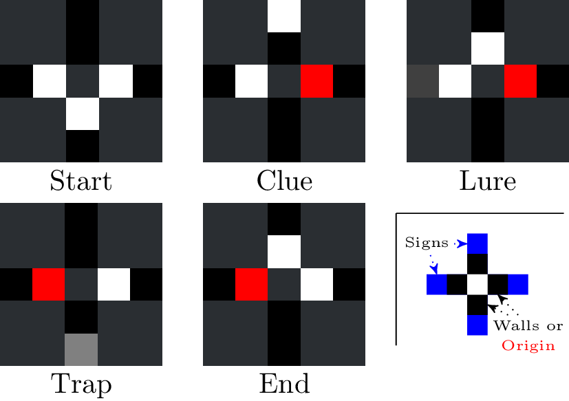
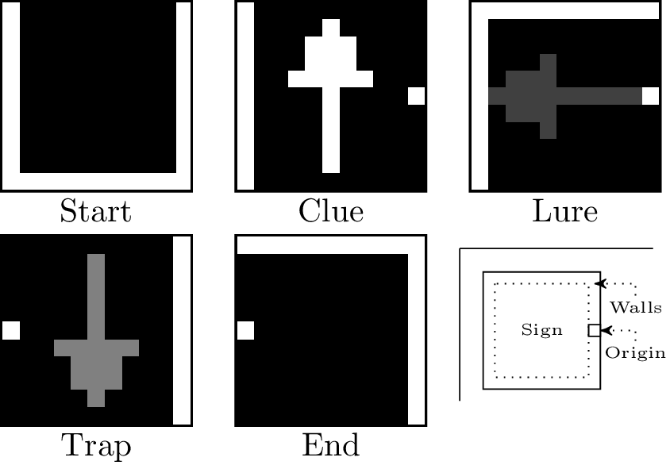
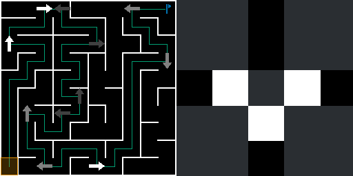
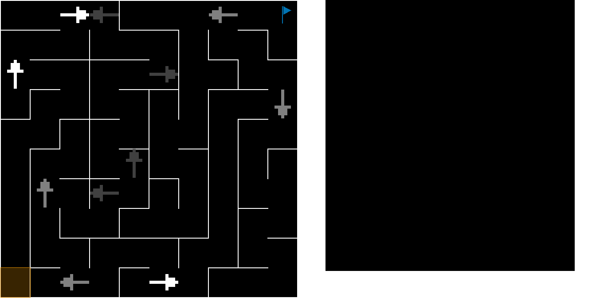
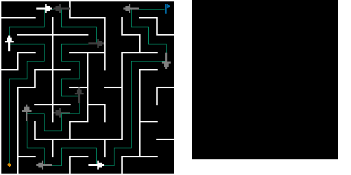

# Summary

The need to provide fair comparisons between agents, especially in the field of Reinforcement Learning, has led to a plethora of benchmarks.
However these benchmarks are, for the most part, devoted to tailor made problems with very little degrees of freedom for the experimenter.
AMaze is, instead, a benchmark *generator* capable of producing human-intelligible environment of arbitrarily high complexity.
By using, potentially custom-made, visual cues in a maze-navigation task, the library empowers researchers across a large breadth of fields.

# Statement of need

AMaze is a pure-python package with an emphasis towards easy and intuitive generation, evaluation and analysis of mazes.
Its primary goal is to provide a way to quickly generate mazes of targeted difficulty e.g. to test a Reinforcement Learning algorithm.
Without paraphrasing the documentation[^1] too an unreasonable extent, users of AMaze have two main components to take into consideration: mazes and agents.

## Mazes
Every maze can be described by human-readable string as illustrated in \autoref{fig:maze}, where every component is optional with sensible default values (excepted the *seed* which is time-dependent).
The *seed* is used in the random number generator responsible for: a) the depth-first search that creates the part and b) the stochastic placement of the *lures* and *traps*.
As will be detailed below, agents only see a single cell at a time making intersections impossible to handle without additional information.
*Clues* provide such an information by helpfully pointing towards the correct direction.
However, users may additionally specify the presence of *traps*, at a given frequency, to replace a clue at an intersection.
Traps always point towards the wrong direction (randomly so in case of a three-way intersection) thereby forcing agents to discriminate between the two.
Furthermore, there is a lighter class of negative sign, namely *lures*, which occur outside of intersection and unhelpfully point towards an obviously bad direction (e.g. going into a wall).

Mazes can broadly be grouped by class depending on the features they exhibit.
The most *trivial* cases correspond to mazes with a single path (enforced by "filling-in" intersections).
When intersections are labeled with appropriate clues mazes are considered as *simple*.
Additionally exhibiting either lures or traps form the corresponding classes while the more general case with all types of signs is labeled as *complex*.

To accurately compare between different types of mazes across multiple categories, the library provides two dedicated metrics.
The surprisingness $S_M$ and deceptiveness $D_M$ for a given maze $M$ are as follows:
$$S_M = - \sum\limits_{i \in I_M} p(i) * log_2(p(i))$$
$$D_M = \sum\limits_{c \in \text{cells}(M)}
           \sum\limits_{\substack{s \in \text{traps}(M)\\s[0:3] = c}}
            - p(s|c) log_2(p(s|c))$$

[^1]: [https://amaze.readthedocs.io/en/latest/](https://amaze.readthedocs.io/en/latest/)

{ width=80% }

## Agents

Agents in AMaze are loosely embodied robots that wander around mazes perceiving only local information (the cell they are in) and a single bit of memory (the direction they come from, if any).
To accommodate various use cases, these agents come in three different forms: fully discrete, fully continuous and hybrid.
In the former case, an agent has access to something akin to a pre-processed input, as in \autoref{fig:d}, where the first four fields

{ width=33% }

{ width=33% }

<!-- { width=33% } -->
<!-- { width=33% } -->
<!-- { width=33% } -->

Citations to entries in paper.bib should be in
[rMarkdown](http://rmarkdown.rstudio.com/authoring_bibliographies_and_citations.html)
format.

If you want to cite a software repository URL (e.g. something on GitHub without a preferred
citation) then you can do it with the example BibTeX entry below for @fidgit.

For a quick reference, the following citation commands can be used:
- `@author:2001`  ->  "Author et al. (2001)"
- `[@author:2001]` -> "(Author et al., 2001)"
- `[@author1:2001; @author2:2001]` -> "(Author1 et al., 2001; Author2 et al., 2002)"

# Figures

Figures can be included like this:

and referenced from text using \autoref{fig:example}.

Figure sizes can be customized by adding an optional second parameter:
{ width=20% }

# Acknowledgements

We acknowledge contributions from Brigitta Sipocz, Syrtis Major, and Semyeong
Oh, and support from Kathryn Johnston during the genesis of this project.

# References
